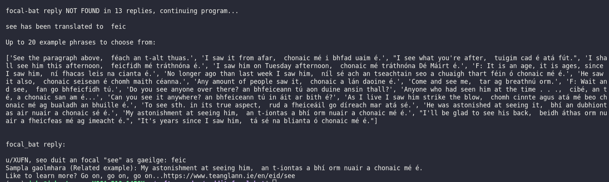
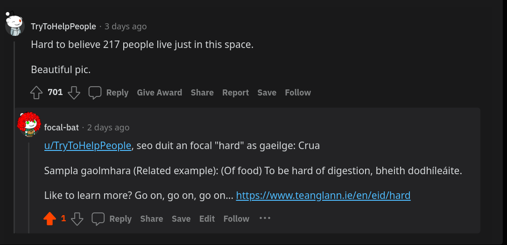
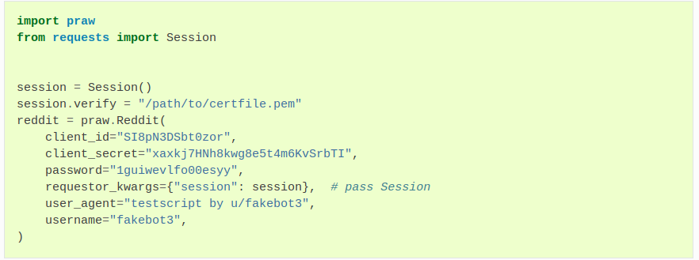

# FOCAL-BAT 

## Description 
_focal-bat is a 'word of the day' comment bot_  

## Project Goal
_The idea spawned from an interest in forum board reply bots, natural language processing and a love for languages. The goal of this project is to promote the Irish language by giving it more exposure on a forum for Ireland, comprised of 448k members. With only 4% of the population using Irish on a daily basis it needs the exposure. By piggybacking on Reddits' poling system, I take the top comment of the top post of the day and directly reply to it with a personalized Irish word of the day. With this approach I maximize the number of users that will see my bot and therefore read a bit of Irish and potentially go a bit deeper and click the attached link_  

### **Tech Used**
* Python
  * Packages
    * praw
    * spacy
    * beautifulsoup4
    * html5lib

### **Features**
focal-bat ensures a reliable translation by using the nlp library's tokenization and lammetization. It checks both English to Irish and Irish to English dictionary entries to ensure the best word is selected for a response. After scraping and formatting the results it constructs a reply. A related phrase and a link to the dictionary entry is also included in the reply. The reply is addressed to the author of the comment.

### *Sample Console Output*

  

### *In App Response*

### **To Run This Project**

This script was developed in a Python virtual environment 

* pip install praw
* pip install spacy
* pip install beautifulsoup4
* pip install html5lib

This project requires the developer to register a reddit app. After which they will receive a personal use script id and a secret. These along with the redditor's username and password are to be used in the creation of a Reddit instance, example below 

On the reddit app the client_id can be found under personal use script

